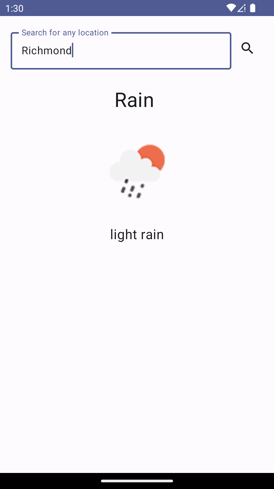
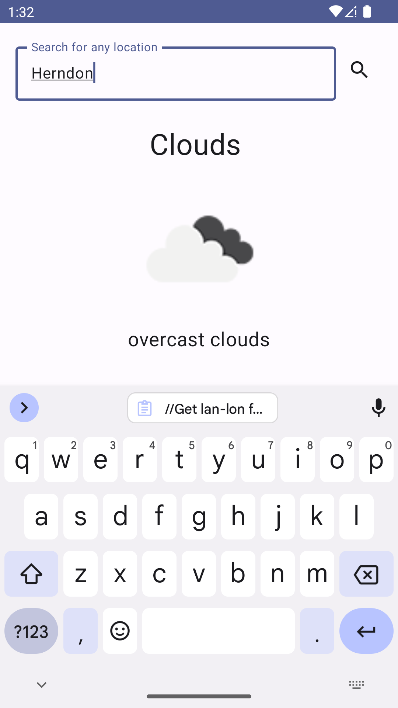
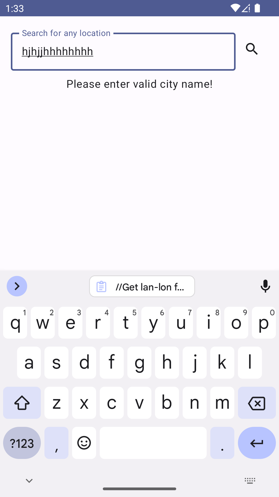

## Libraries and Frameworks Used
- **Kotlin** as it provides modern features, concise syntax, null safety.
- **Dagger- Hilt**  for dependency injection.
- **Retrofit and OkHttp** for making network requests to RESTful APIs.
- **Jetpack Compose** as it is modern UI toolkit for declarative UI.
- **MVVM Architecture** is Design pattern to separate program logic and user interface controls.
- **Livedata** tonotifies Observer objects when data changes.
- **Coil** libray in android to load images.
- **Coroutines**  for concurrent tasks.

## Screenshots from the app

